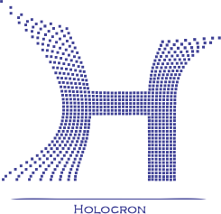

# Holocron

<p align="center">
  
</p>

Extração de referências em bases de dados à partir de termo de busca

Um vocabulário foi definido para facilitar a comunição e pode ser encontrado [aqui](vocabulario.md).

## Instalação

TODO

## Como executar?

TODO

TODO: termo de busca nas aranhas deve ser dinâmico

```


                                                    +--------+         +------------+
                                               +--->+base de |         |artigos     +------+
                                               |    |dados A +-------->+exportado   |      |
     +------------+      +--------------+      |    +--------+         +------------+      v
     | Termo de   +----->+autenticação  |      |    +--------+         +------------+  +---------+
     | busca      |      |(opcional)    +---------->+base de +-------->+artigos     +->+Mendeley |
     +------------+      +--------------+      |    |dados B |         |exportados  |  |         |
                                               |    +--------+         +------------+  +---------+
                                               |    +--------+         +------------+       ^
                                               +--->+base de +-------->+artigos     |       |
                                                    |dados C |         |exportados  +-------+
                                                    +--------+         +------------+


```


**rascunhos**
- recebe termo de busca como entrada (inicialmente focaremos em palavras chaves)
- pode receber autenticação para utilização de base de dados não livres
- busca revistas de acordo com área de conhecimento
- faz paginação de artigos(com base em entrada do usuário) em formato exporatável para mendeley
